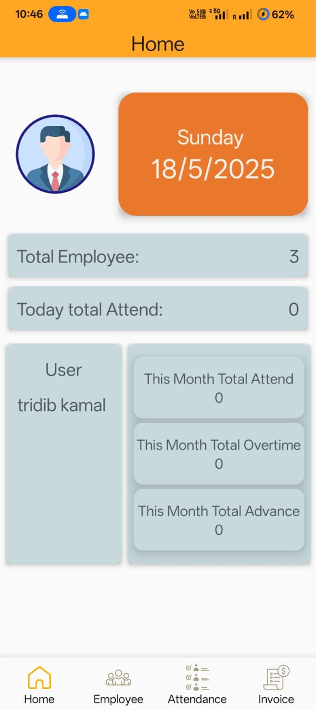
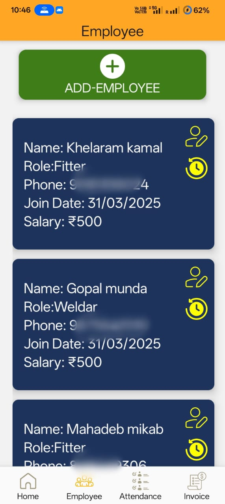
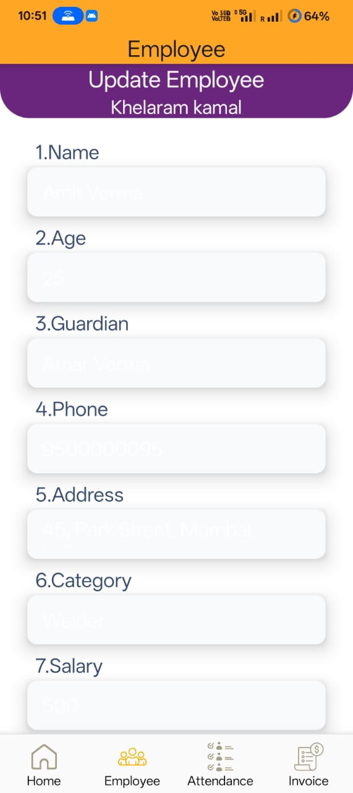
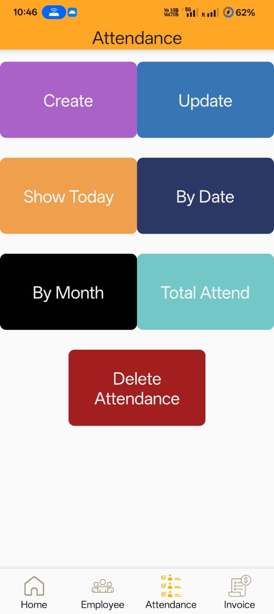
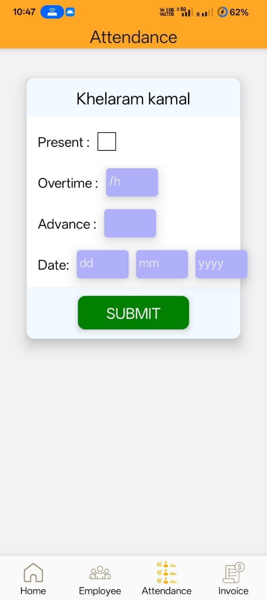
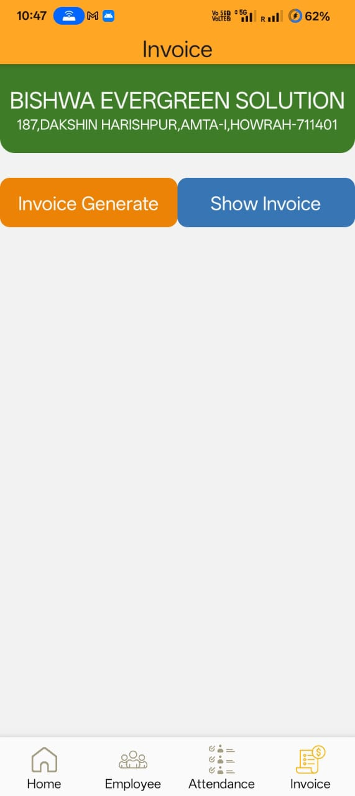

# 📱 Employee Management App

A cross-platform mobile application built using **React Native with Expo**, designed to streamline and simplify employee management tasks. This app allows administrators to manage employees efficiently with features like employee listing, attendance tracking, profile management, and more.

---

## 🚀 Features

- 📋 **Employee List** – View and manage a list of all employees with relevant details.
- ➕ **Add/Edit Employee** – Add new employees or update existing employee information.
- ✅ **Attendance Tracker** – Mark and view daily attendance for employees.
- 🔍 **Search & Filter** – Easily search and filter employee data.
- 🔐 **Authentication** – Secure login/signup functionality for admin access.
- 🖼️ **Profile Picture Upload** – Upload and manage employee profile images.
- 📊 **Dashboard Overview** – View quick stats like total employees, attendance rate, etc.
- 💶 **Invoices**

---

## 🛠️ Tech Stack

- **Frontend**: [React Native]
- **Backend**: Node.js, Express 
- **Database**: MongoDB 
- **Navigation**: React Navigation
- **UI Frameworks**: NativeBase / React Native Paper 

---

👨‍💻 Author
Tridib Kamal
📧 tridibkamal13@gmail.com

App preview

